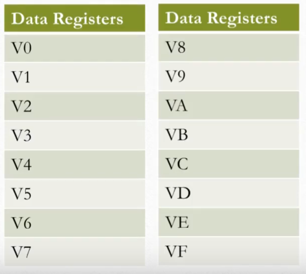
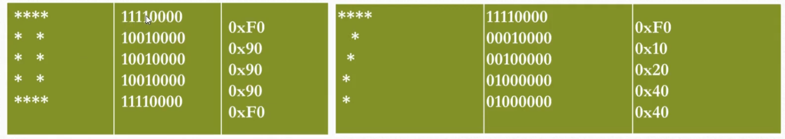
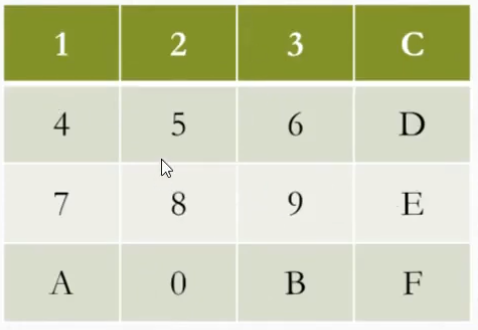

# What is Chip-8

The Chip-8 is essentially a programming language and virtual machine to make the development of games easier. The Chip-8 interpreter could be a build target for game developers and the interpreter could abstract away physical hardware concerns. More details about the Chip-8 [here](https://en.wikipedia.org/wiki/CHIP-8)


See the core functionality of my emulator look in the CPU implementation [here](https://github.com/Coutlaw/RustyChip/blob/master/cpu/src/cpu.rs)

## Memory

```
+---------------+= 0xFFF (4095) End of Chip-8 RAM
|               |
|               |
|               |
|               |
|               |
| 0x200 to 0xFFF|
|     Chip-8    |
| Program / Data|
|     Space     |
|               |
|               |
|               |
+- - - - - - - -+= 0x600 (1536) Start of ETI 660 Chip-8 programs
|               |
|               |
|               |
+---------------+= 0x200 (512) Start of most Chip-8 programs
| 0x000 to 0x1FF|
| Reserved for  |
|  interpreter  |
+---------------+= 0x000 (0) Start of Chip-8 RAM
```

The bottom reserved memory is for things like character sets

## Stack

The stack has 16, 16 bit values used to store the address that the Chip8 should return to when returning a subroutine. Chip8 allows for up to 16 levels of nested subroutines

The stack is not a part of the memory lay out, it is separate.

## Registers

the chip8 has 16 8 bit data registers, each register can hold 1 byte of information



The data registers should be implemented with an array with a size of 16

### The I register

there is a 16 bit register I to store memory addresses

### The Program Counter

The chip8 has a 16 bit (2 bytes) Program Counter register that points to the address of the current instruction being executed

### Stack Pointer

Chip8 has an 8 bit Stack Pointer register that points to a location in the stack.

### Sound Timer + Delay Timer

these are each 8 bit registers and when they are below 0 they decrement at a rate of 60Hz

When sound is 0 the sound no longer plays, decrements by 60Hz

The delay timer keeps the program from executing instructions when the delay timer is above 0. it also decrements at 60Hz, and the program will continue executing instructions when the delay timer is back to 0.

## Instructions

Instructions in the Chip8 are 2 bytes in size, this is why we always increment the Program Counter by 2

there are 36 different instructions for implementation in the Chip8

## Display

the display is a 64x32 monochrome

Drawing is done with sprites, not pixels. sprites wrap the screen

Sprites are many pixels grouped together that can be drawn to the screen as a whole

I chose to use the minifb crate to handle display values, and I scaled the 64 x 32 pixel display by a factor of 10



Sprites can be a max of 8 bits in width, and 15 bits in height.

There is a draw instruction in the Chip8 so it knows what to draw

Sprites get XOR'd onto the display, if this causes any pixels to be erased then the VF register is set to 1, else 0

## Keyboard

16 keys from 0F, you could represent this with a 16 byte array. We would have to map our physical keyboard to this old keyboard.



Here are the key mappings I used

```rs
match key {
        Some(Key::Key1) => Some(0x1),
        Some(Key::Key2) => Some(0x2),
        Some(Key::Key3) => Some(0x3),
        Some(Key::Key4) => Some(0xC),

        Some(Key::Q) => Some(0x4),
        Some(Key::W) => Some(0x5),
        Some(Key::E) => Some(0x6),
        Some(Key::R) => Some(0xD),

        Some(Key::A) => Some(0x7),
        Some(Key::S) => Some(0x8),
        Some(Key::D) => Some(0x9),
        Some(Key::F) => Some(0xE),

        Some(Key::Z) => Some(0xA),
        Some(Key::X) => Some(0x0),
        Some(Key::C) => Some(0xB),
        Some(Key::V) => Some(0xF),
        _ => None,
    }
```
## How to run

Prerequisites: you will need rust installed, and I have only tested this on a Mac

to run use `cargo run roms/{rom}` where rom is the name of the individual rom you want to run, and it must exist inside `./roms`.
Ex: `cargo run roms/TETRIS` to run the TETRIS rom.
## Credits
- http://mattmik.com/files/chip8/mastering/chip8.html

- https://www.youtube.com/watch?v=ml44mHKd0ss

- http://devernay.free.fr/hacks/chip8/C8TECH10.HTM#0.0
